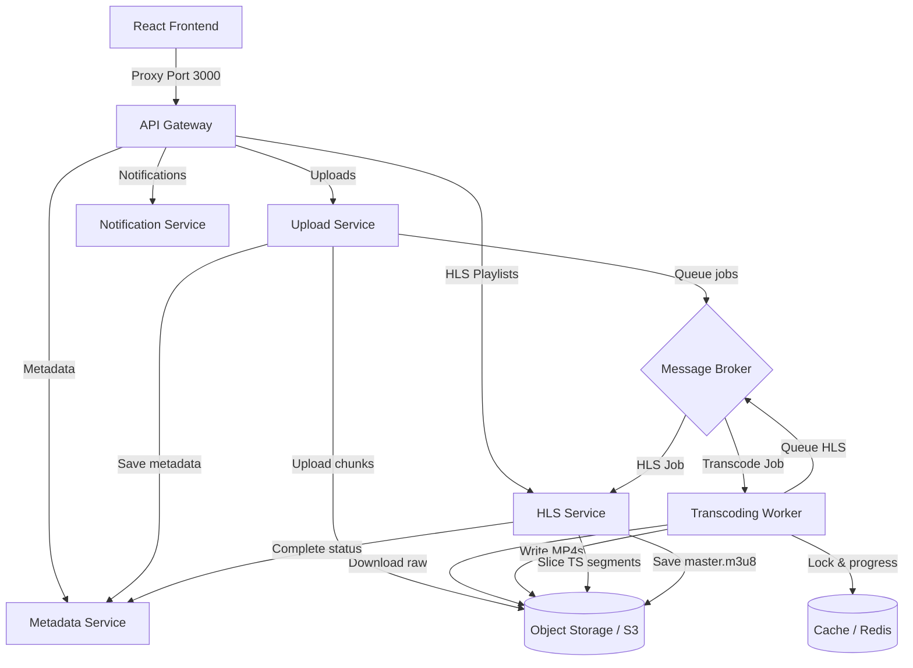

# Falcon

A microservice-based pipeline that uploads videos, transcodes them, and packages them as HLS streams for adaptive playback.

---

## How it works (High Level)



### The steps:
1. **Upload**: The frontend slices a video into chunks and uploads them to the upload service. The service stream-uploads them straight to S3.
2. **Database entry**: Once the storage gets all the parts, the video metadata and transcoding jobs are saved.
3. **Transcode**: The upload service fires transcoding tasks into a message broker. Transcoding workers pick them up, convert the video to various resolutions using FFmpeg, and upload the outputs back to S3.
4. **HLS Packaging**: When the versions are ready, the HLS service takes over, slices the MP4 files into TS segments, creates the `.m3u8` playlists, and updates the video status to completed in the DB so it can be streamed.

---

## Project Structure

- `frontend/` - React app using Tailwind and Video.js.
- `database/` - Postgres tables schema and database migration scripts.
- `kubernetes/` - Deployment configs and Horizontal Pod Autoscalers (HPA).
- `monitoring/` - Prometheus and Grafana metrics setups.
- `services/`
  - `shared/` - Common database, Redis, and message broker connections.
  - `api-gateway/` - Proxy router that handles rate limiting and CORS.
  - `upload-service/` - Orchestrates multipart uploads to S3.
  - `metadata-service/` - CRUD api for users, videos, and processing jobs.
  - `transcoding-worker/` - FFmpeg processor that runs the encodings.
  - `hls-service/` - Generates master and variant m3u8 playlists.
  - `notification-service/` - Simple endpoint to pull video transcoding progress from Redis.

---

## Service Ports Reference

| Port | Service | Access Type | Description |
|---|---|---|---|
| **5173** | Frontend | Public | User dashboard UI |
| **3000** | API Gateway | Public | Gateway proxying all requests |
| **9001** | Object Storage Console | Public (Dev) | Local storage console GUI |
| **15672** | Message Broker UI | Public (Dev) | Queue manager console GUI |

*Note: All backend services and databases run internally and are accessed securely via the API Gateway or internal Docker networks.*

---

## Quick Start

### What you need:
- **Node.js 20+**
- **Docker Desktop**
- **FFmpeg** (installed locally if running workers directly on your host machine)

### 1. Run Setup
Run the following script to install npm packages, spin up Docker infrastructure, create your `.env` file, and run DB migrations:
```powershell
npm run setup
```

### 2. Start Developing
Make sure Docker is running, then choose one:

**Option A (Fastest)**
```powershell
npm run start
```
This launches the Docker containers and starts both frontend and backend development servers in one go.

**Option B (Separate terminals for debugging)**
```powershell
# 1. Spin up base services
npm run docker:up

# 2. Run backend microservices
npm run dev

# 3. Start a transcoding worker
npm run dev:worker

# 4. Start the frontend
npm run dev:frontend
```

### 3. Check health & Run E2E Test
```powershell
npm run verify          # Ping all backend services
npm run test:e2e        # Run a test upload, transcoding, and play test
```

---

## License

This project is licensed under the MIT License - see the [LICENSE](file:///d:/falcon/LICENSE) file for details.

